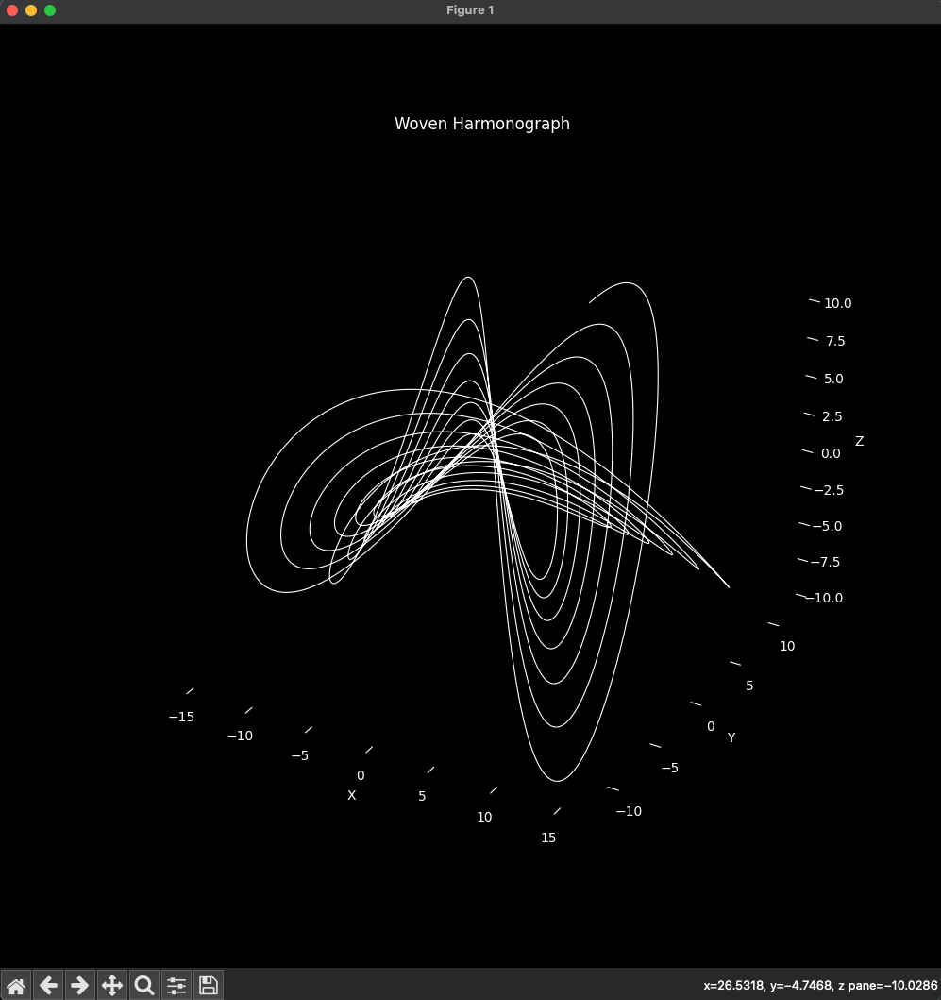

# Lissajoy: Harmonic Patterns in 3D

**Explore the mesmerizing beauty of harmonic patterns generated by simulated pendulums**

This project visualizes harmonographs in 3D, creating intricate and captivating designs. It serves as the profile picture for my Medium.com blog

# Preview: 

## Overview

Harmonographs are created by plotting the motion of damped harmonic oscillators, simulating the movement of pendulums. This repository provides Python code to generate and visualize these patterns in a 3D space, allowing for a deeper appreciation of their complexity and elegance.

## Features

* **3D Harmonic Pattern Generation:** Creates intricate 3D visualizations of harmonographs using Matplotlib.
* **Parameter Customization:** Easily adjust parameters like frequencies, amplitudes, damping factors, and phases to generate diverse patterns.
* **Visual Enhancements:** Includes features for color gradients, adjustable line widths, and black background for stunning visuals.
* **Static and Animated Outputs:** Generates both static images and animated visualizations.
* **Clean and Professional Code:** Simple, well-documented Python code for easy understanding and modification.

 
